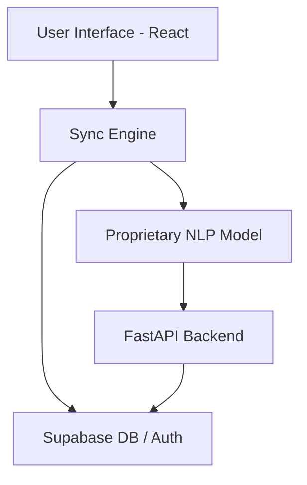

<p align="center">
  
</p>

<h1 align="center">Mithra AI</h1>

<p align="center">
  <strong>The Ultimate Life Operating System — Precision Built for High Performance.</strong>
</p>

<p align="center">
  Mithra AI is a world-class, all-in-one productivity platform designed to eliminate chaos and empower users to "Start Living." Built with a sleek <strong>Midnight & Cyan</strong> aesthetic, Mithra combines tasks, habits, calendar, journal, focus timer, and a proprietary NLP-powered AI assistant into one seamless experience.
</p>

<p align="center">
  <a href="https://mithra-life-os.vercel.app">🌐 Live Demo</a> • 
  <a href="https://github.com/hemasaivattikuti25/Mithra-AI-life-os/issues">🚀 Report Bug</a> •
  <a href="https://github.com/hemasaivattikuti25/Mithra-AI-life-os/pulls">🤝 Contribute</a>
</p>

<p align="center">
  
  
  
</p>

---

## 📦 Table of Contents
- [✨ Core Philosophy](#-core-philosophy)
- [🚀 Features](#-features)
- [📸 System Preview](#-system-preview)
- [🛠️ Tech Stack](#-tech-stack)
- [🏗️ Project Architecture](#-project-architecture)
- [💻 Getting Started](#-getting-started)
- [🤝 Support the Project](#-support-the-project)
- [👨‍💻 About the Creator](#-about-the-creator)

---

## ✨ Core Philosophy
Mithra isn't just a productivity app; it's a **Life OS**. It was built to solve the frustration of juggling 5+ different apps just to stay organized. Everything in Mithra is interconnected—your habits feed into your daily planning, and your journal entries provide context for your AI assistant, **Dost**.

---

## 🚀 Features

### 🎯 Precision Task Management
- **Intelligent Prioritization**: Rank tasks by impact and urgency.
- **Deep Hierarchies**: Subtasks, categories, and smart filtering.
- **AI Planning**: Dost suggests what to work on next based on your current load.

### 📅 Unified Schedule
- **Time Blocking**: Drag-and-drop management for your entire day.
- **Global Visibility**: Seamlessly switch between Day, Week, Month, and Year views.
- **Proprietary Sync**: Export to `.ics` to keep your external calendars aligned.

### 🔥 Habit & Focus Hub
- **GitHub-style Streaks**: Visualize your consistency over time.
- **Deep Work Mode**: Pomodoro-based focus timer with detailed analytics.
- **Milestone Tracking**: Celebrate every win, no matter how small.

### 🤖 Dost Mode (Proprietary NLP AI)
- **Natural Language Parsing**: Create your whole day's tasks with a single sentence.
- **Context-Aware Insights**: AI that knows your mood, load, and history.
- **Privacy First**: No external Google APIs. Your data, your rules.

---

## 📸 System Preview

<p align="center">
  
  <br><em>The Dashboard — Your mission control for the day.</em>
</p>

<p align="center">
  
  
  <br><em>Proprietary Task Management and Unified Calendar views.</em>
</p>

<p align="center">
  
  
  <br><em>Emotional analytics and consistent habit tracking.</em>
</p>

<p align="center">
  
  <br><em>Dost Mode — Your proprietary NLP companion.</em>
</p>

---

## 🛠️ Tech Stack

| Category | Technology | Purpose |
|----------|------------|---------|
| **Frontend** | React 18.3 | High-performance UI library |
| **Styling** | Tailwind CSS | Utility-first "Aesthetic Tech" design |
| **Motion** | Framer Motion | Fluid, world-class animations |
| **AI/NLP** | Proprietary Model | Privacy-focused context understanding |
| **Backend** | FastAPI + Python | Robust API and NLP processing |
| **Database** | Supabase | Secure PostgreSQL & Real-time storage |
| **Deployment**| Vercel | Scalable, high-speed hosting |

---

## 🏗️ Project Architecture



---

## 💻 Getting Started

### Prerequisites
- Node.js 18+
- Python 3.10+
- Supabase account

### Installation

1. **Clone the Repo**
   ```bash
   git clone https://github.com/hemasaivattikuti25/Mithra-AI-life-os.git
   cd Mithra-AI-life-os
   ```

2. **Frontend Setup**
   ```bash
   cd ClientScheduler/client
   npm install
   npm run dev
   ```

3. **Backend Setup** (Optional for NLP)
   ```bash
   cd ../../server
   pip install -r requirements.txt
   python main.py
   ```

---

## 🤝 Support the Project

Mithra AI is a **community-first, open-source project**. If this tool helps you organize your life, please consider supporting us:

- **Star this repository** to help others find it! ⭐
- **Report bugs** or suggest features via issues.
- **Contribute** to the code and help us build the future.

---

## 👨‍💻 About the Creator

<p align="left">
  
  
  **Hemasai Vattikuti**  
  CSE Student • ML Enthusiast • Builder  
  
  Hey! I'm a pre-final year Computer Science student who got tired of juggling 5 different apps just to stay productive. Between my DRDO internship, machine learning projects, and intensive coursework, I built Mithra AI to solve my own chaos.
  
  If this helps even one person get their life together, it's worth it.
</p>

<p align="left">
  <a href="https://www.linkedin.com/in/hemsaivattikuti"></a>
  <a href="https://github.com/hemasaivattikuti25"></a>
  <a href="https://www.instagram.com/hemasai_chowdary/"></a>
</p>

---

<p align="center">
  Built with ❤️ by Hemasai Vattikuti
</p>
