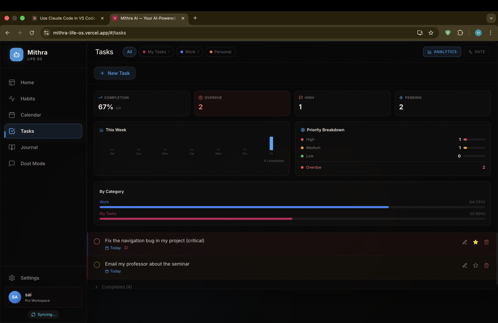
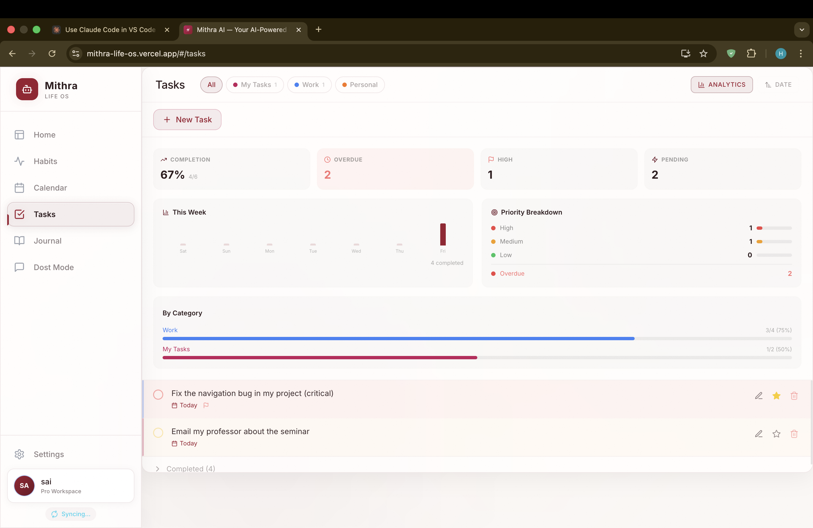
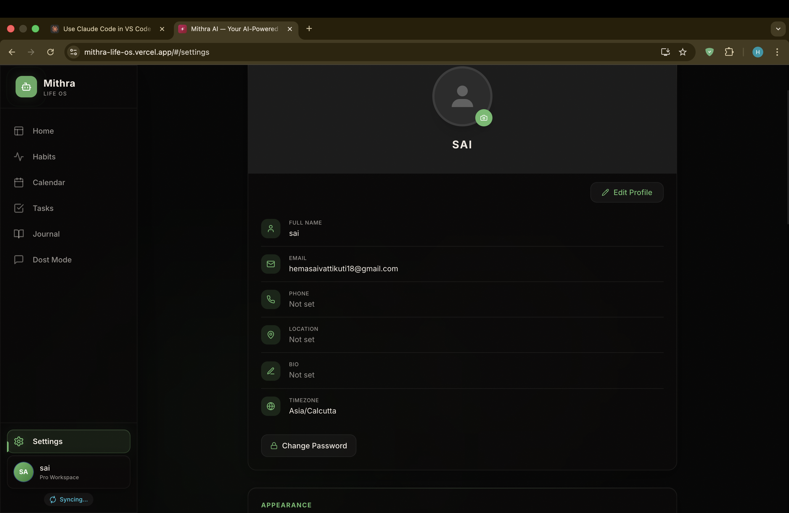

<div align="center">


# Mithra Life OS

**The AI-Powered Personal Operating System**

Tasks · Habits · Calendar · Journal · Focus · Dost AI · Blend

[](https://mithra-life-os.vercel.app)
[](https://github.com/hemasaivattikuti25/Mithra-AI-life-os/stargazers)
[](LICENSE)
[](https://github.com/hemasaivattikuti25/Mithra-AI-life-os/issues)

</div>

---

> **Most productivity apps make you manage the app.** Mithra manages your life.

Mithra is a **full-stack, AI-powered Life Operating System** that unifies tasks, habits, calendar, journal, focus timer, and a real-memory AI companion into one beautiful, offline-first workspace. Built solo, from scratch, with clean architecture.

<div align="center">

</div>

---

## ✨ Features

### Core Modules

| Module | Highlights |
|:---|:---|
| 🤖 **Dost AI** | Stoic AI companion powered by **Gemini 1.5 + RAG vector memory** from your journal. Remembers everything. |
| ✅ **Smart Tasks** | Subtasks, priorities, recurring schedules, Kanban views, CSV/Excel import |
| 🔥 **Habit Tracking** | GitHub-style 365-day heatmap, streak milestones, category grouping |
| 📅 **Calendar** | Google Calendar sync, day/week/month views, AI natural language parsing |
| 📓 **Mood Journal** | Mood scores, tags, AI sentiment analysis, weekly trend charts |
| ⏱️ **Focus Timer** | Pomodoro timer + stopwatch, session history, deep work analytics |
| 👫 **Mithra Blend** | Shared workspaces — invite friends, track goals together, social accountability |
| 🌐 **Offline-First** | Custom sync engine — works without internet, syncs on reconnect |

### Production-Grade Architecture

| Feature | Details |
|:---|:---|
| 🛡️ **Error Boundary** | Global crash handler with graceful fallback UI |
| 💀 **Loading Skeletons** | Page-specific shimmer placeholders (Dashboard, Tasks, Habits, Journal) |
| 🎯 **Onboarding Tour** | 5-step guided tooltip walkthrough for first-time users |
| 📊 **Analytics Ready** | PostHog-compatible event tracking (zero-dependency stub) |
| ⚡ **Rate Limiting** | Backend middleware: 20/min AI, 10/min auth, 60/min default |
| 📈 **Usage Tracking** | Per-user AI call counts + token tracking (paywall-ready) |
| 🔒 **Row Level Security** | All Supabase tables locked down with RLS policies |

---

## 📸 Screenshots

<div align="center">

| Dashboard | Tasks | Habits |
|:---:|:---:|:---:|
|  |  |  |

| Dost AI | Calendar | Journal |
|:---:|:---:|:---:|
|  |  |  |

| Focus Timer | Settings & Themes | Analytics |
|:---:|:---:|:---:|
|  |  |  |

</div>

---

## 🛠️ Tech Stack

```
Frontend     React 18 · Vite · Vanilla CSS · Framer Motion · Capacitor
Backend      FastAPI · Python · bcrypt · JWT Auth · Rate Limiter
Database     Supabase (PostgreSQL + pgvector) · Row Level Security
AI           Gemini 1.5 Flash · RAG (vector embeddings + semantic search)
Deploy       Vercel (frontend) · Railway/Render (backend)
```

---

## 🚀 Getting Started

### Prerequisites

- **Node.js** v18+
- **Python** 3.10+
- [Supabase](https://supabase.com) account (free tier works)
- [Gemini API key](https://ai.google.dev) (free)

### 1. Clone & Setup

```bash
git clone https://github.com/hemasaivattikuti25/Mithra-AI-life-os.git
cd Mithra-AI-life-os
```

### 2. Frontend

```bash
cd client-app/client
npm install
cp .env.example .env.local   # Add your Supabase URL + anon key
npm run dev                    # → http://localhost:5173
```

### 3. Backend (for AI features)

```bash
cd client-app/server
pip install -r requirements.txt
cp .env.example .env           # Add GEMINI_API_KEY, SUPABASE_URL, JWT_SECRET
uvicorn main:app --reload      # → http://localhost:8000
```

### 4. Database

Run `client-app/Supabase_Master.sql` in your **Supabase SQL Editor** — it creates all tables, RLS policies, and helper functions in one idempotent script.

---

## 📁 Project Structure

```
Mithra-AI-life-os/
├── client-app/
│   ├── client/                   # React frontend
│   │   ├── src/
│   │   │   ├── components/       # ErrorBoundary, Layout, Skeletons, Tour
│   │   │   ├── context/          # Auth + Data contexts
│   │   │   ├── pages/            # Dashboard, Tasks, Habits, Calendar, etc.
│   │   │   ├── services/         # Supabase, workspace, analytics
│   │   │   └── native/           # Capacitor bridge
│   │   └── public/               # Assets, OG image, manifest
│   ├── server/                   # FastAPI backend
│   │   ├── core/                 # Config, rate limiter
│   │   ├── routers/              # Auth, chat, tasks endpoints
│   │   ├── schemas/              # Pydantic models
│   │   └── services/             # Business logic
│   └── Supabase_Master.sql       # Complete DB schema (single file)
├── docs/assets/                  # Screenshots & branding
└── README.md
```

---

## 🔒 Security

- Passwords hashed with **bcrypt** (passlib)
- Stateless **JWT authentication** (30-day tokens)
- **Row Level Security** on every Supabase table
- **Rate limiting** on AI and auth endpoints
- **CORS** locked to production domains
- No secrets in source code

---

## 🌐 Live Demo

> 👉 **[https://mithra-life-os.vercel.app](https://mithra-life-os.vercel.app)**
>
> Sign up with email or Google OAuth. Free forever.

---

## 📱 Android App

[](https://github.com/hemasaivattikuti25/Mithra-AI-life-os/releases/latest)

---

## 👤 About the Creator

<div align="center">


### Hemasai Vattikuti

**Engineering Student · Full Stack Developer · AI Researcher**

[](https://www.linkedin.com/in/hemsaivattikuti)
[](https://github.com/hemasaivattikuti25)
[](mailto:hemasaivattikuti25@gmail.com)

</div>

---

## ⭐ Support

If Mithra helped you, give it a star!

[](https://github.com/hemasaivattikuti25/Mithra-AI-life-os)

---

<div align="center">
  Built with ❤️ by <b>Hemasai Vattikuti</b> &nbsp;·&nbsp; MIT License
</div>
