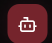
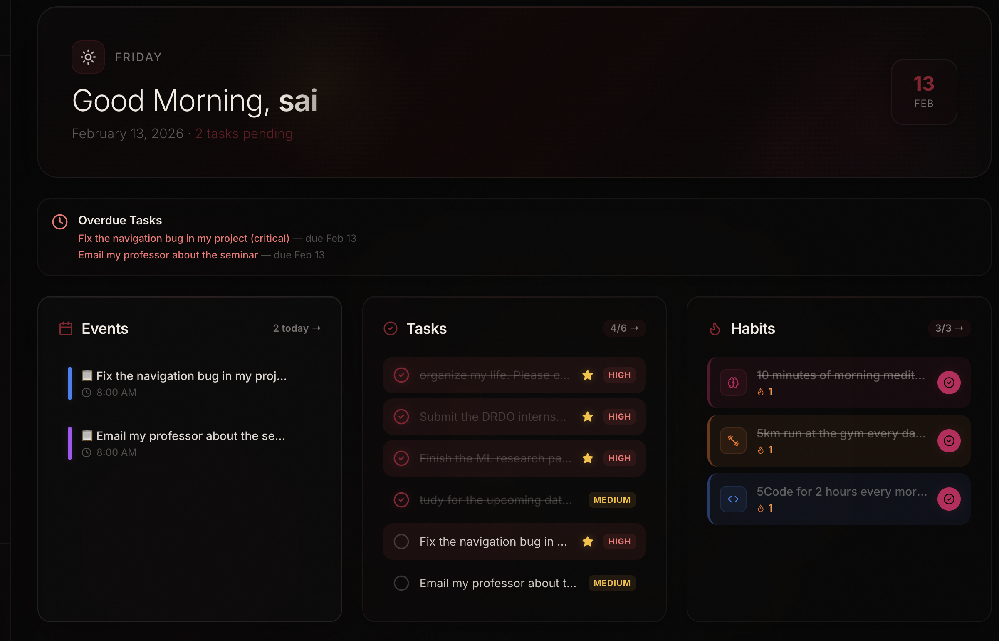
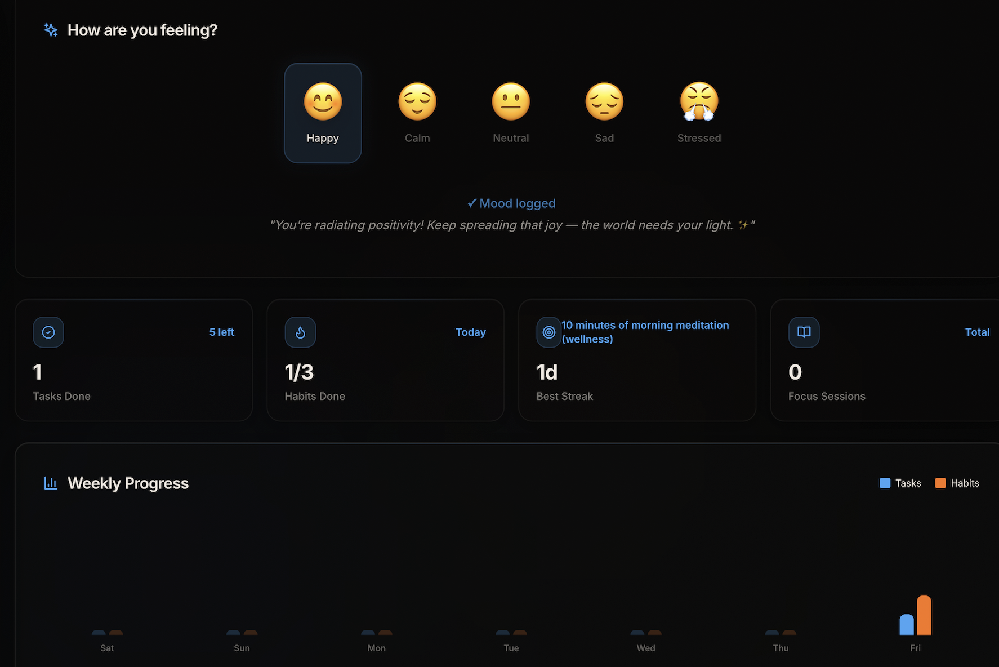
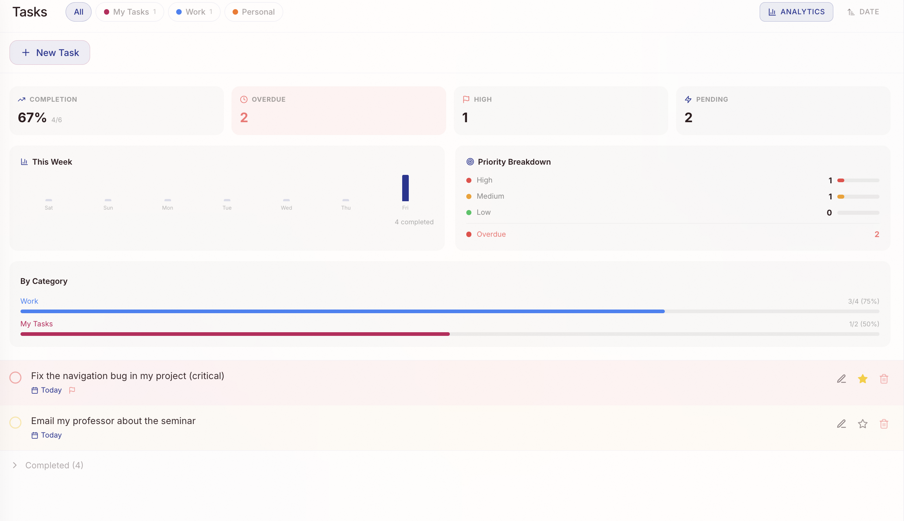
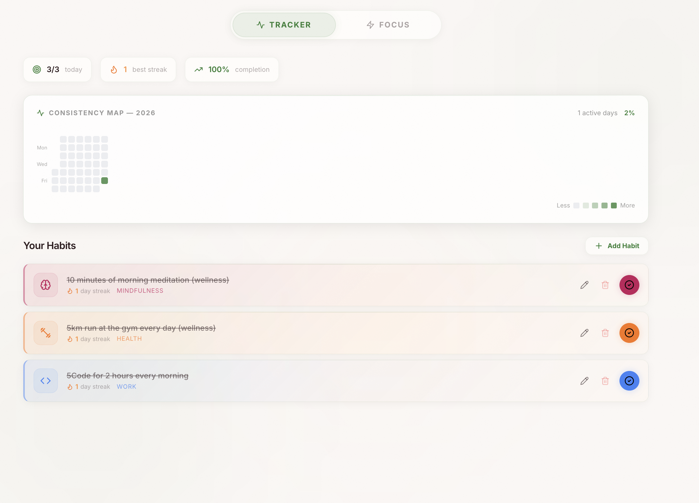
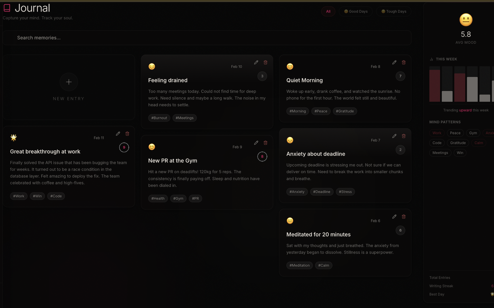
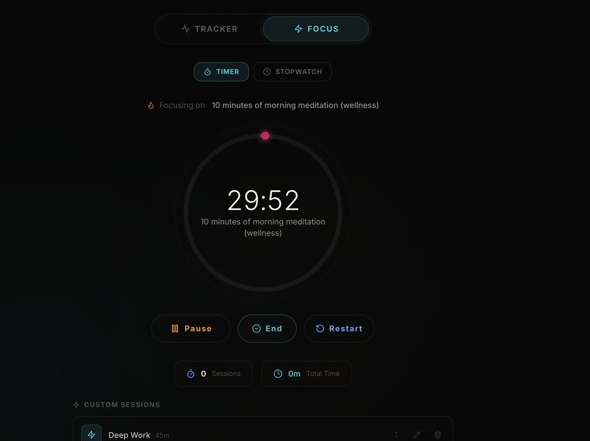
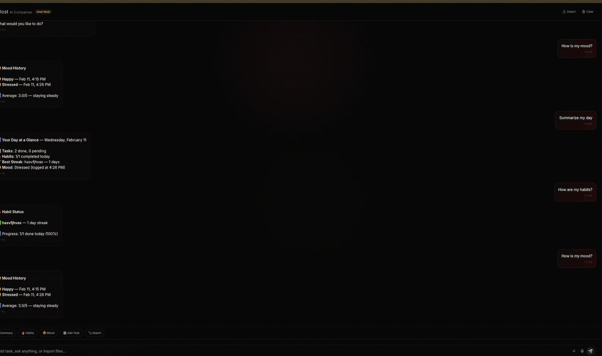

<div align="center">
  

  <h1 style="font-size: 3rem; margin-top: 20px;">Mithra AI</h1>

  <p style="font-size: 1.2rem; max-width: 600px;">
    <strong>The Ultimate Life Operating System — Precision Built for High Performance.</strong>
  </p>

  <p>
    <a href="https://mithra-life-os.vercel.app">
      
    </a>
    <a href="https://github.com/hemasaivattikuti25/Mithra-AI-life-os/issues">
      
    </a>
    <a href="https://github.com/hemasaivattikuti25/Mithra-AI-life-os/stargazers">
      
    </a>
    <a href="https://github.com/hemasaivattikuti25/Mithra-AI-life-os/blob/main/LICENSE">
      
    </a>
  </p>
</div>

---

## 🚀 About The Project

**Mithra AI** is not just another productivity app; it's a comprehensive **Life Operating System** designed to eliminate chaos. It seamlessly integrates tasks, habits, calendar, journaling, and a focus timer into one unified, aesthetically pleasing workspace.

Powered by a proprietary NLP model ("Dost"), Mithra understands your workload and helps you plan your day with a single sentence.

<div align="center">
  
</div>

### ✨ Key Features

| Feature | Description | Preview |
| :--- | :--- | :--- |
| **Unified Workspace** | A central dashboard giving you a bird's-eye view of your entire life. Tasks, habits, and mood—all in one place. |  |
| **Smart Tasks** | Create tasks with deep hierarchies, priorities, and deadlines. Filter by category and let AI suggest your next move. |  |
| **Consistency Hub** | Track your habits with GitHub-style streak graphs. Visualize your progress and stay motivated. |  |
| **Mood Journal** | Log your thoughts and track your emotional well-being over time. Discover what makes you happy. |  |
| **Focus Timer** | A built-in Pomodoro timer to help you enter deep work states. Track your focus sessions and efficiency. |  |
| **Dost AI** | Your personal AI companion. Chat with Dost to organize your day, get advice, and clear your mind. |  |

---

## 🛠️ Tech Stack

This project is built using the following technologies:

| Category | Technology |
| :--- | :--- |
| **Frontend** |    |
| **Backend** |   |
| **Database** |  |
| **Deployment** |  |

---

## 💻 Getting Started

### Prerequisites

*   **Node.js** (v18 or higher)
*   **Python** (v3.10 or higher)
*   **Supabase Account**

### Installation

1.  **Clone the Repository**
    ```bash
    git clone https://github.com/hemasaivattikuti25/Mithra-AI-life-os.git
    cd Mithra-AI-life-os
    ```

2.  **Frontend Setup**
    ```bash
    cd ClientScheduler/client
    npm install
    npm run dev
    ```

3.  **Backend Setup** (Optional for local AI)
    ```bash
    cd ../../server
    pip install -r requirements.txt
    python main.py
    ```

---

## 🤝 Contributing

Contributions are what make the open-source community such an amazing place to learn, inspire, and create. Any contributions you make are **greatly appreciated**.

1.  Fork the Project
2.  Create your Feature Branch (`git checkout -b feature/AmazingFeature`)
3.  Commit your Changes (`git commit -m 'Add some AmazingFeature'`)
4.  Push to the Branch (`git push origin feature/AmazingFeature`)
5.  Open a Pull Request

---

## 📬 Contact

**Hemasai Vattikuti** - Founder & Developer

<p align="left">
  <a href="https://www.linkedin.com/in/hemsaivattikuti">
    
  </a>
  <a href="https://github.com/hemasaivattikuti25">
    
  </a>
  <a href="https://www.instagram.com/hemasai_chowdary/">
    
  </a>
</p>

---

<div align="center">
  <p>Made with ❤️ by <a href="https://github.com/hemasaivattikuti25">Hemasai Vattikuti</a></p>
</div>

## 📬 Contact

<div align="center">
  
  
  ### Hemasai Vattikuti
  
  **Software Engineer | Data Scientist | Full Stack Developer**
  
  <a href="https://www.linkedin.com/in/hemsaivattikuti">
    
  </a>
  <a href="https://github.com/hemasaivattikuti25">
    
  </a>
  <a href="mailto:hemasaivattikuti25@gmail.com">
    
  </a>

  <p align="center">
    Built with ❤️ by a student dev at VIT-AP University.
  </p>
</div>
