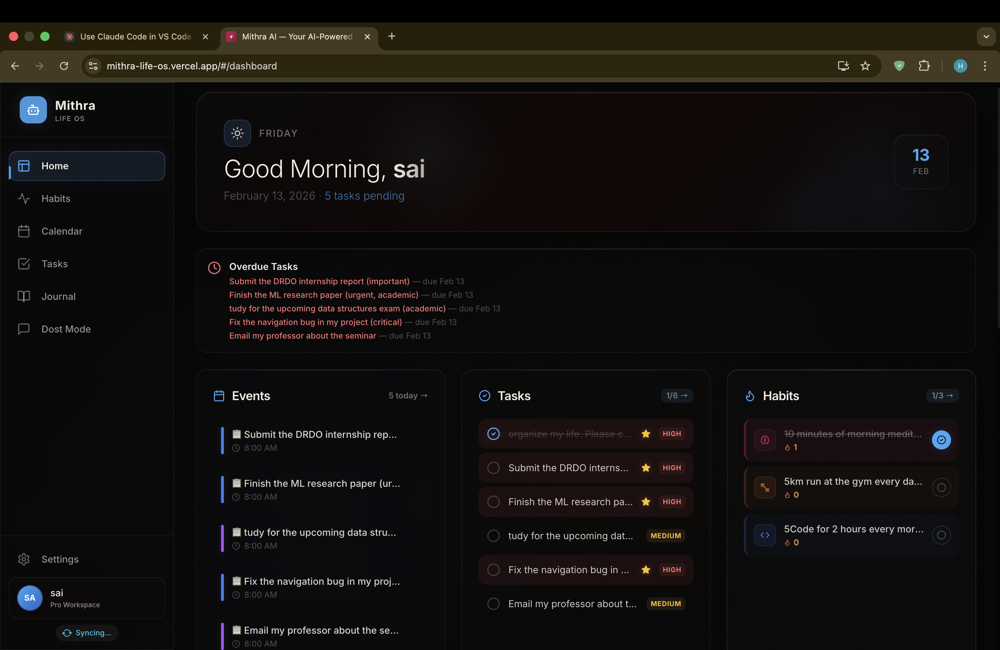
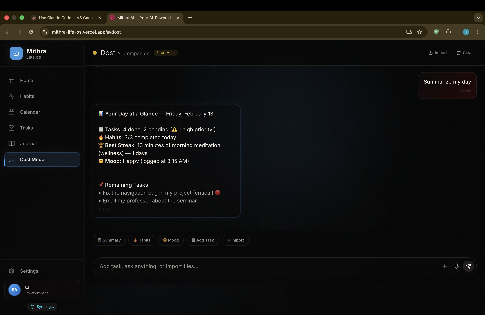
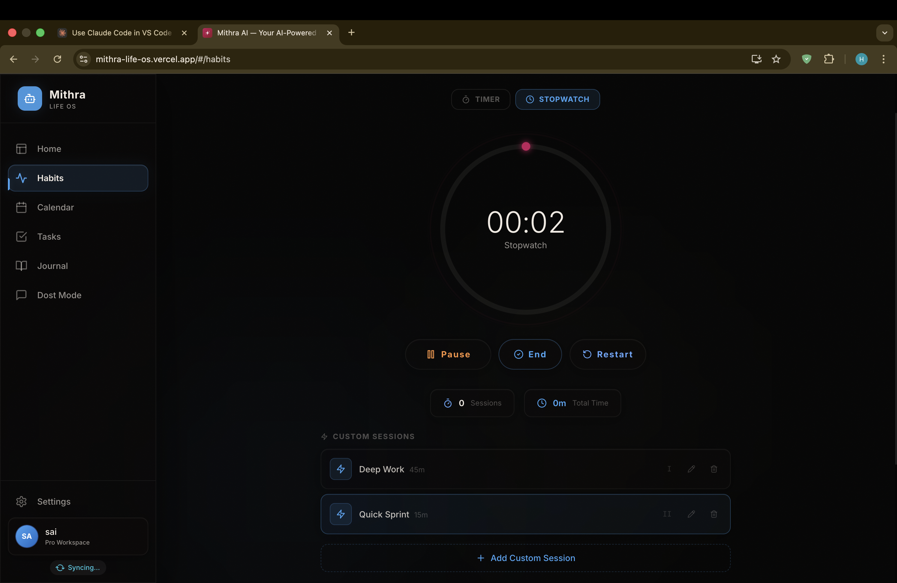
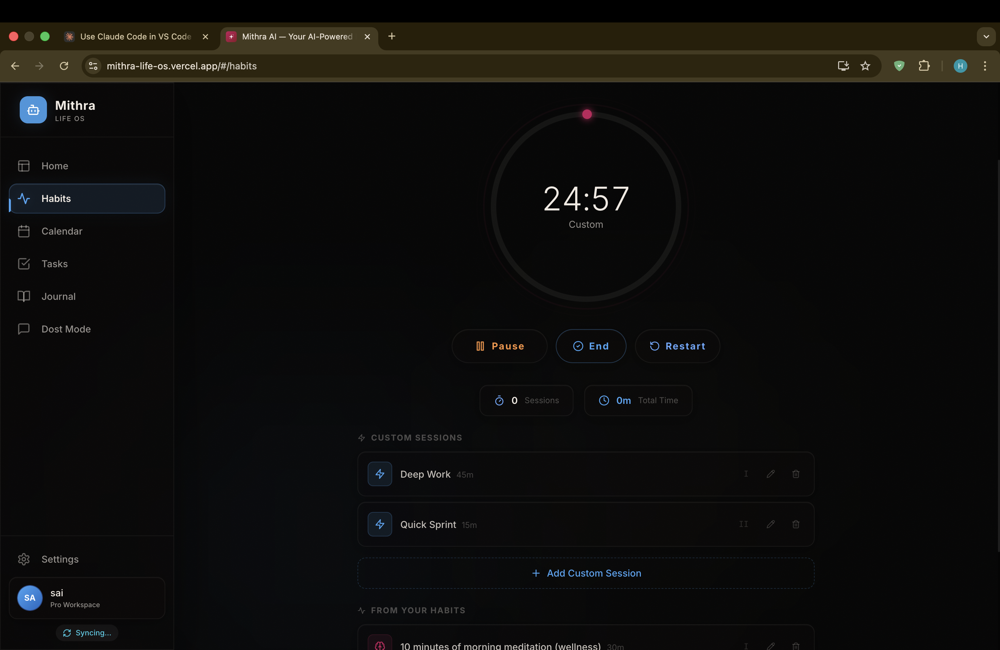
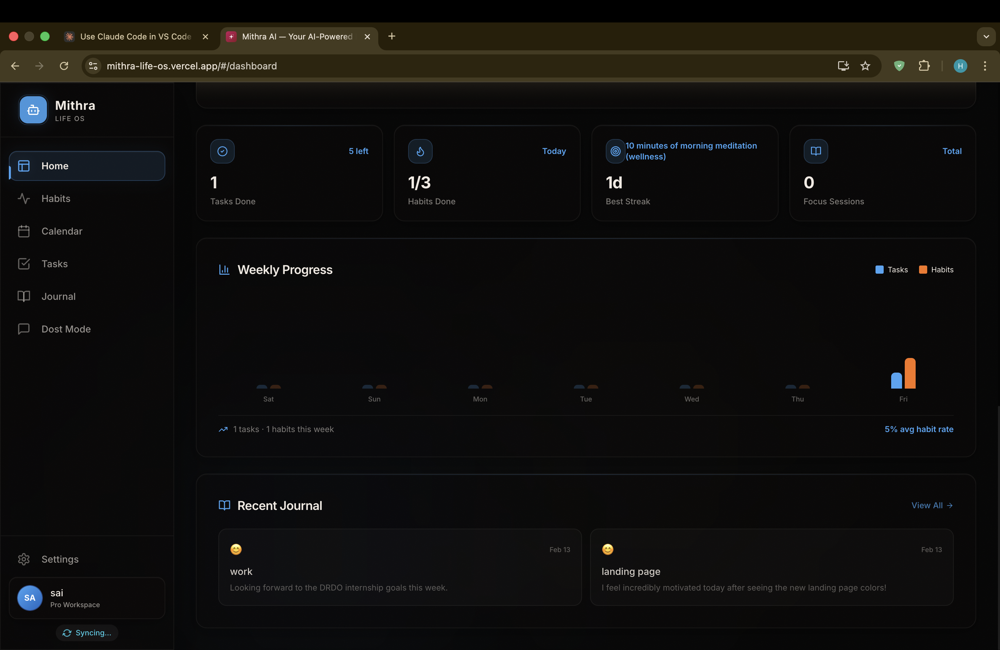
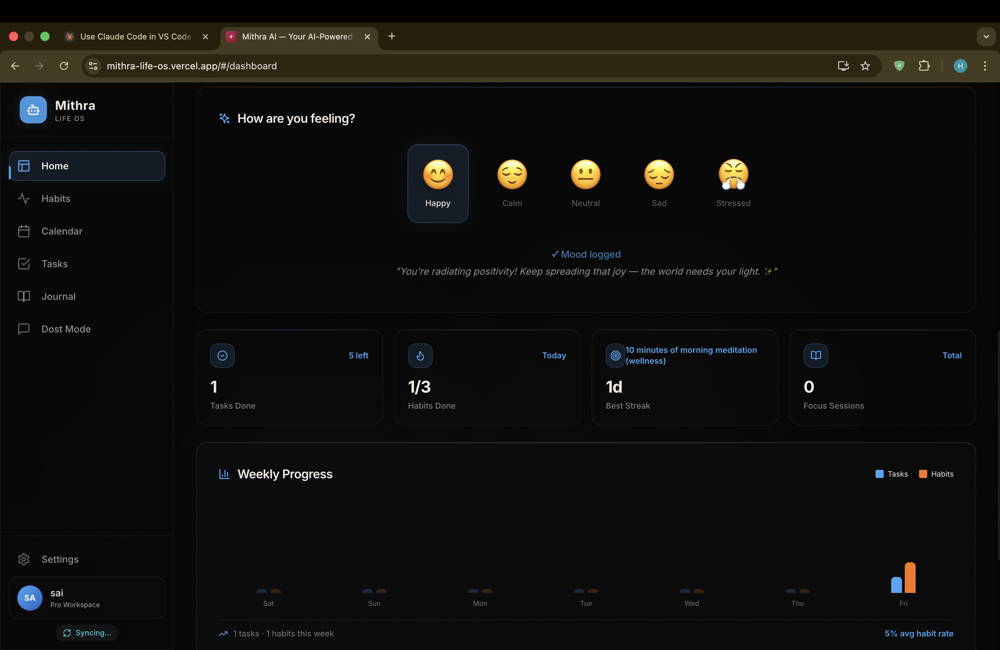

<div align="center">
  
  <h1>Mithra Life OS</h1>
  <p><b>The AI-First Productivity Operating System</b></p>
  <p><i>Manage your entire life from one place — or just text a bot.</i></p>
  
  [](https://mithra-lifeos.com)
  [](https://github.com/hemasaivattikuti25/Mithra-AI-life-os/stargazers)
  [](https://github.com/hemasaivattikuti25/Mithra-AI-life-os/issues)
  [](LICENSE)
</div>

<br />

## 📖 About Mithra Life OS

**Mithra** is an AI-powered life operating system that unifies task management, habit tracking, smart scheduling, and AI journaling into a single, hyper-fast interface. Built for professionals, students, and anyone who refuses to juggle five different apps.

What makes Mithra different? **AI is not a feature — it's the foundation.** Every interaction is backed by a context-aware engine that knows your tasks, your habits, your mood, and your schedule. And soon, you won't even need to open the app — just text a WhatsApp or Telegram bot and your AI assistant handles the rest.

---

## ✨ Core Features

| Feature | Description |
| :--- | :--- |
| **🚀 Mission Control** | A unified dashboard with real-time productivity trends, AI usage metrics, streak counters, and active focus sessions. |
| **✅ Smart Tasks** | Nested subtasks, drag-and-drop reordering, priority flagging, recurring schedules, and Google Calendar syncing. |
| **🔥 Habit Focus Hub** | GitHub-style heatmap streaks, multi-session focus timers, streak freeze protection, and synergy tracking. |
| **🤝 Mithra Blend** | Real-time shared workspaces. Link habits with friends and track aggregate completion scores via a unified slider. |
| **📓 Zen Journal** | AI-analyzed daily entries powered by Google Gemini. Mood trajectory mapping with rich text editing. |
| **🧠 Dost AI** | A conversational AI companion aware of your full life context — predicts workflows, reviews habits, and gives personalized advice. |
| **📊 AI Analytics** | Token usage tracking, model performance insights, and intelligent rate limiting to keep AI interactions efficient. |
| **🔄 Sync Engine** | Optimistic UI with bi-directional sync, offline queuing, and automatic conflict resolution. |

---

## 🎯 What's Built & Shipping

Mithra is a fully functional AI-powered productivity platform with 690+ active users. Core features include task management with subtasks, habit tracking with GitHub-style heatmaps, Google Calendar integration, AI journaling with mood analysis, and Mithra Blend — multiplayer workspaces for shared accountability. The backend enforces zero-trust Row-Level Security at the PostgreSQL layer, and Dost AI uses RAG-powered semantic search with pgvector for context-aware conversations.

---

## 🛠️ Tech Stack

| Layer | Technologies |
| :--- | :--- |
| **Frontend** | React 18, Vite 5, Framer Motion, TailwindCSS, Capacitor (Android/iOS) |
| **Backend** | Python 3.12, FastAPI, Uvicorn |
| **Database** | Neon PostgreSQL, pgvector (AI embeddings) |
| **Authentication** | Firebase Auth (Email/Password + Google OAuth) |
| **AI Engine** | Google Gemini 1.5 Flash, RAG pipeline, context-aware prompts |
| **Deployment** | Vercel (Frontend), Render (Backend) |
| **Upcoming** | WhatsApp Business API, Telegram Bot API, Webhooks |

---

## 📸 See It In Action

<div align="center">
  
  
  <br/><br/>
  
  
  <br/><br/>
  
  
</div>

---

## 🚀 Getting Started

### Prerequisites
* **Node.js** v18+ &nbsp;·&nbsp; **Python** v3.10+
* **Firebase** project (free tier)
* **Neon** PostgreSQL database (free tier)
* **Gemini API Key** from Google AI Studio

### Backend Setup
```bash
git clone https://github.com/hemasaivattikuti25/Mithra-AI-life-os.git
cd Mithra-AI-life-os/client-app/server

python -m venv .venv && source .venv/bin/activate
pip install -r requirements.txt
cp .env.example .env   # Fill in your credentials
uvicorn main:app --reload --port 8000
```

### Frontend Setup
```bash
cd ../client
npm install
cp .env.example .env   # Fill in your Firebase config
npm run dev
```

---

## 🔐 Environment Variables

### Server (`/client-app/server/.env`)
| Variable | Description |
| :--- | :--- |
| `NEON_DATABASE_URL` | Neon PostgreSQL connection string |
| `FIREBASE_SERVICE_ACCOUNT_JSON` | Firebase Admin SDK JSON key |
| `GEMINI_API_KEY` | Google Gemini API key |
| `ENVIRONMENT` | `development` or `production` |

### Client (`/client-app/client/.env`)
| Variable | Description |
| :--- | :--- |
| `VITE_FIREBASE_API_KEY` | Firebase Web API key |
| `VITE_FIREBASE_AUTH_DOMAIN` | Firebase Auth domain |
| `VITE_FIREBASE_PROJECT_ID` | Firebase Project ID |
| `VITE_FIREBASE_STORAGE_BUCKET` | Firebase Storage bucket |
| `VITE_FIREBASE_MESSAGING_SENDER_ID` | Firebase Messaging Sender ID |
| `VITE_FIREBASE_APP_ID` | Firebase App ID |
| `VITE_API_URL` | Backend URL (`http://localhost:8000` or Render URL) |

---

## 🗂️ Project Structure

```text
Mithra-AI-life-os/
├── client-app/
│   ├── client/                  # React Frontend (Vite + Capacitor)
│   │   ├── public/              # Static assets, manifest, service worker
│   │   ├── src/
│   │   │   ├── components/      # Reusable UI components
│   │   │   ├── context/         # Auth & Data providers
│   │   │   ├── pages/           # Route-level views
│   │   │   └── services/        # Firebase client, API layer, sync engine
│   │   └── android/             # Capacitor Android wrapper
│   └── server/                  # FastAPI Backend
│       ├── core/                # Config, security, rate limiting
│       ├── routers/             # REST endpoints (Chat, Tasks, Calendar, Workspaces)
│       ├── schemas/             # Pydantic models
│       ├── services/            # AI engine, auth, calendar logic
│       └── main.py              # Application entrypoint
├── docs/                        # Screenshots & promotional assets
└── README.md
```

---


---


---

## 🤝 Contributing

Contributions are welcome and appreciated.

1. **Fork** the repository
2. **Create** your feature branch (`git checkout -b feature/AmazingFeature`)
3. **Commit** your changes (`git commit -m 'Add AmazingFeature'`)
4. **Push** to the branch (`git push origin feature/AmazingFeature`)
5. **Open** a Pull Request

---

## 📄 License

MIT License — see [LICENSE](LICENSE) for details.

---

## 📬 Contact

**Hemasai Vattikuti** — Backend & Applied AI Engineer. Built production systems at DRDL–DRDO (Ministry of Defence). Shipping Mithra Life OS — AI productivity platform with 690+ users, RAG semantic search, and zero-trust architecture.

[](https://www.linkedin.com/in/hemasai-vattikuti-61266b268/)
[](https://github.com/hemasaivattikuti25)
[](mailto:sivasaiohm2005@gmail.com)

**Live App:** [https://mithra-lifeos.com](https://mithra-lifeos.com)
